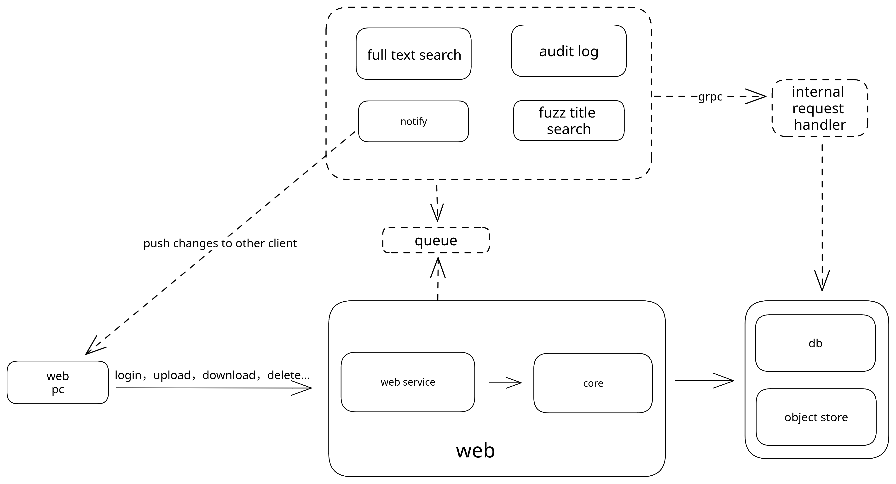

- Feature Name: my-cloud
- Start Date: 2023-03-28

## Summary
[summary]: #summary

Create a self-hosted cloud using rust.

## Motivation
[motivation]: #motivation

I want a cloud store without privacy concerns and it could be a resource for my AI assistant in the future to learn what I want to do and what I need to do. Thus it could give me some advice and help me to enjoy my life.


## Archtecture
[archtecture]: #archtecture



## 1. web service
### 1. Upload/update resource 
```
method: POST
url: /api/storage/{id}?filename={filename}&&is_dir={is_dir}
body: octream
response: 200,201, 409, 401
```

### 2. Modify file or dir name
```
method: PUT 
url: /api/storage/{id}
body: formdata
    filename: text
response:
    200
    201
    401
    409
```

### 2. Download file
`GET /api/storage/{id}`

### 3. Delete File or Dir
`DELETE /api/storage/{id}`

### 4. Get File List
```json
method: GET 
url: /api/storage/{id: dir_id}
response: json
[
    {
        filename: string
        is_dir: boolean
        id: string
        size: number
        type: string
    }
]
```

### 2. core

File will be stored in the two parts: meta data and file content. 

#### 1. Meta data
Meta data is stored in file history table. Every time when a file is modified, a new record will be inserted into the file history table. The file history table will record the file version, slices and slices hash. Slices is ordered array and slices hash is the hash of every slice.

#### 2. File content
Every file content will be cut into slices and max size of every slice is 4MB and slice_id is uuid. Hash of slice can't be used as slice_id because the hash of slice is not unique. File content will be stored in the file system or s3 or azure blob or etc. Slices store sturcture is `slice_id[0]/slice_id[1]/slice_id`. This is to avoid some directories is too big to load slowly, but it remains to be verified.


### 3. db schema
postgres sql
#### 1. user 
```sql

create table user table (
    id bigint not null primary key,
    username varchar(255) not null,
    password varchar(255) not null,
    email varchar(255) not null,
    ...
);
```

#### 2. file
```sql
create table file (
    id bigint not null primary key,
    uid bigint not null,
    filename varchar(255) not null,
    parent_dir_id bigint not null,
    version: int not null,
    is_dir boolean not null,
    size bigint not null,
    -- is_deleted default is false
    is_deleted boolean not null default false,
    ...
);
```

#### 3. file history 
```sql
create table file_history (
    id bigint not null primary key,
    fid bigint not null,
    file_version int not null,
    -- slice is array
    slices text[] not null,
    slices_hash text[] not null,
    ...
);
```
## Reference-level explanation

TBD


## Drawbacks
N/A


## Rationale and alternatives
N/A

## Prior art
N/A

## Unresolved questions


## Future possibilities
